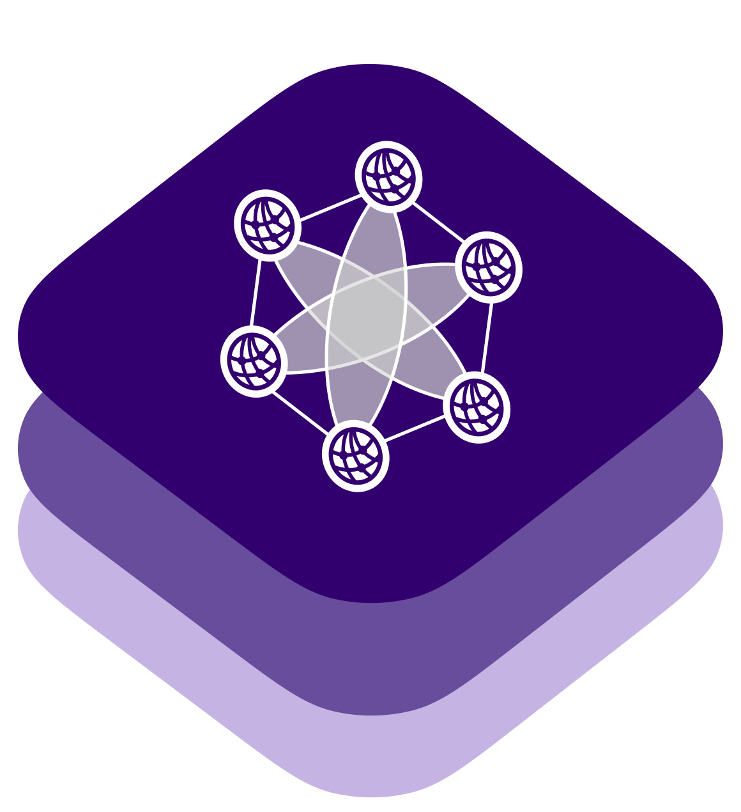

<div align="center">

</div>

---

LCLPing is a cross-platform Ping library written in Swift, and for Swift. It is designed to help streamline testing, measuring, and monitoring network reachability of a host for both the client side and server side applications and services. 

# LCLPing


## Requirements
- Swift 5.9+
- macOS 10.15+, iOS 14+, Linux

## Getting Started


### Swift Package Manager (SPM)

Add the following to your `Package.swift` file:
```code
.package(url: "https://github.com/Local-Connectivity-Lab/lcl-ping.git", from: "0.2.0")
```

Then import the module to your project
```code
.target(
    name: "YourAppName",
    .dependencies: [
        .product(name: "LCLPing", package: "lcl-ping")
    ]
)
```

### Basic Usage

```swift
// create ping configuration
let icmpConfig = ICMPPingClient.Configuration(endpoint: .ipv4("127.0.0.1", 0), count: 1)
let httpConfig = try HTTPPingClient.Configuration(url: "http://127.0.0.1:8080", count: 1)

// initialize test client
let icmpClient = LCLPing(pingType: .icmp(icmpConfig))
let httpClient = LCLPing(pingType: .http(httpConfig))

do {
    // run the test using SwiftNIO EventLoopFuture
    let result = try icmpClient.start().whenComplete { res in
        switch (res) {
        case .success(let summary):
            print(summary)
        case .failure(let error):
            print(error)
        }
    }
} catch {
    print("received: \(error)")
}

do {
    let result = try httpClient.start().wait()
    print(result)
} catch {
    print("received: \(error)")
}
```

You can also run the [demo](/Sources/Demo/README.md) using `make demo` or `swift run Demo` if you do not have make installed.

### Features
- Ping via ICMP and HTTP(S)
- Support IPv4 
- flexible and configurable wait time, time-to-live, count, and duration
- HTTP(S) supports parsing Server-Timing header to account for time taken by server processing


## Contributing
Any contribution and pull requests are welcome! However, before you plan to implement some features or try to fix an uncertain issue, it is recommended to open a discussion first. You can also join our [Discord channel](https://discord.com/invite/gn4DKF83bP), or visit our [website](https://seattlecommunitynetwork.org/).

## License
LCLPing is released under Apache License. See [LICENSE](/LICENSE) for more details.
